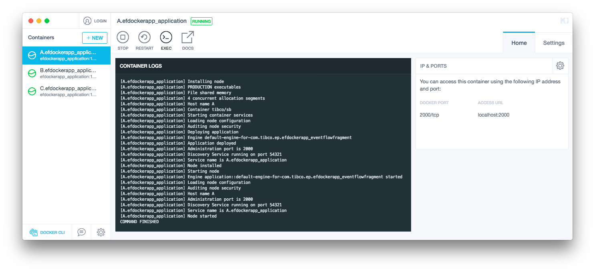

# Cloud examples

* [Docker images](#docker-images)
* [References](#references)

<a name="docker-images"></a>

## Docker images

Using an appropriate maven plugin, such as [docker-maven-plugin](https://github.com/fabric8io/docker-maven-plugin}docker-maven-plugin),
docker images can be created.  A typical base image would contain :

* Base operating system ( such as CentOs )

* Additional operating system packages

* StreamBase runtime

* Startup script

A typical application image would be based on the image above and then add :

* Application

Using a two-step docker image improves build performance.

The parent pom ep-application-docker, contains docker build rules, so 
a basic pom.xml to achieve this is shown below :

``` xml
<?xml version="1.0" encoding="UTF-8"?>
<project xmlns="http://maven.apache.org/POM/4.0.0" xmlns:xsi="http://www.w3.org/2001/XMLSchema-instance" xsi:schemaLocation="http://maven.apache.org/POM/4.0.0 http://maven.apache.org/xsd/maven-4.0.0.xsd">

    <!-- vim: set tabstop=4 softtabstop=0 expandtab shiftwidth=4 smarttab : -->

    <modelVersion>4.0.0</modelVersion>

    <groupId>com.tibco.ep</groupId>
    <artifactId>dockerapp</artifactId>
    <packaging>ep-application</packaging>
    <version>10.4.0</version>
    <name>hello application</name>

    <!-- common definitions for this version of StreamBase -->
    <parent>
        <groupId>com.tibco.ep.sb.parent</groupId>
        <artifactId>ep-application-docker</artifactId>
        <version>10.4.0</version>
    </parent>

    <properties>
        <dockerDomain>example.com</dockerDomain>
    </properties>

</project>
```

Note that this requires docker to be installed.

Additional build rules can be added to start test nodes :

``` xml
<?xml version="1.0" encoding="UTF-8"?>
<project xmlns="http://maven.apache.org/POM/4.0.0" xmlns:xsi="http://www.w3.org/2001/XMLSchema-instance" xsi:schemaLocation="http://maven.apache.org/POM/4.0.0 http://maven.apache.org/xsd/maven-4.0.0.xsd">

    <!-- vim: set tabstop=4 softtabstop=0 expandtab shiftwidth=4 smarttab : -->

    <modelVersion>4.0.0</modelVersion>

    <groupId>com.tibco.ep</groupId>
    <artifactId>dockerapp</artifactId>
    <packaging>ep-application</packaging>
    <version>10.4.0</version>
    <name>hello application</name>

    <!-- common definitions for this version of StreamBase -->
    <parent>
        <groupId>com.tibco.ep.sb.parent</groupId>
        <artifactId>ep-application-docker</artifactId>
        <version>10.4.0</version>
    </parent>

    <properties>
        <dockerDomain>example.com</dockerDomain>
    </properties>

    <build>
        <plugins>
            <plugin>
                <groupId>com.tibco.ep</groupId>
                <artifactId>ep-maven-plugin</artifactId>
                <extensions>true</extensions>
                <configuration>
                    <skipTests>${skipLocalTests}</skipTests>
                    <nodes>
                        <node>A</node>
                        <node>B</node>
                     </nodes>
                 </configuration>
            </plugin>
            <plugin>
                <groupId>io.fabric8</groupId>
                <artifactId>docker-maven-plugin</artifactId>
                <executions>
                <execution>
                    <id>start nodes</id>
                        <phase>pre-integration-test</phase>
                        <goals>
                            <goal>start</goal>
                        </goals>
                        <configuration>
                            <startParallel>true</startParallel>
                            <skip>${skipDockerTests}</skip>
                            <autoCreateCustomNetworks>true</autoCreateCustomNetworks>
                            <images>
                                <image>
                                    <name>%g/%a:%l</name>
                                    <alias>A.${projectartifactId}</alias>
                                    <run>
                                        <network>
                                            <name>${dockerDomain}</name>
                                            <alias>A.${dockerDomain}</alias>
                                        </network>
                                        <hostname>A.${dockerDomain}</hostname>
                                        <env>
                                            <NODENAME>A.${projectartifactId}</NODENAME>
                                        </env>
                                        <log>
                                            <enabled>true</enabled>
                                        </log>
                                        <wait>
                                            <log>COMMAND FINISHED</log>
                                            <time>100000</time>
                                        </wait>
                                        <namingStrategy>alias</namingStrategy>
                                    </run>
                                </image>
                                <image>
                                    <name>%g/%a:%l</name>
                                    <alias>B.${projectartifactId}</alias>
                                    <run>
                                        <network>
                                            <name>${dockerDomain}</name>
                                            <alias>B.${dockerDomain}</alias>
                                        </network>
                                        <hostname>B.${dockerDomain}</hostname>
                                        <env>
                                            <NODENAME>B.${projectartifactId}</NODENAME>
                                        </env>
                                        <log>
                                            <enabled>true</enabled>
                                        </log>
                                        <wait>
                                            <log>COMMAND FINISHED</log>
                                            <time>100000</time>
                                        </wait>
                                        <namingStrategy>alias</namingStrategy>
                                    </run>
                                </image>
                            </images>
                        </configuration>
                    </execution>
                    <execution>
                        <id>stop nodes</id>
                        <phase>post-integration-test</phase>
                        <goals>
                            <goal>stop</goal>
                        </goals>
                        <configuration>
                            <skip>${skipDockerTests}</skip>
                        </configuration>
                    </execution>
                </executions>
            </plugin>
        </plugins>
    </build>

</project>
```

Such a project can be created from the maven archetype using the following command :

``` shell
mvn archetype:generate -B \
   -DarchetypeGroupId=com.tibco.ep -DarchetypeArtifactId=eventflow-application-docker-archetype -DarchetypeVersion=10.4.0 \
   -DgroupId=com.tibco.ep -DartifactId=efdockerapp -Dpackage=com.tibco.ep.efdockerapp -Dversion=1.0.0 -Dname="hello world" -DdockerDomain=example.com
```

When the project is built, a docker image is also created :

``` shell
...
[INFO] --- ep-maven-plugin:${currentVersion}:package-application (default-package-application) @ efdockerapp_application ---
[INFO] Building zip: /Users/plord/workspace/test-archetypes/efdockerapp/efdockerapp-application/target/efdockerapp_application-1.0.0-ep-application.zip
...
[INFO] --- docker-maven-plugin:0.26.0:build (sbrt base image) @ efdockerapp_application ---
[INFO] Copying files to /Users/plord/workspace/test-archetypes/efdockerapp/efdockerapp-application/target/docker/sbrt-base/10.4.0/build/maven
[INFO] Building tar: /Users/plord/workspace/test-archetypes/efdockerapp/efdockerapp-application/target/docker/sbrt-base/10.4.0/tmp/docker-build.tar
[INFO] DOCKER> [sbrt-base:10.4.0]: Created docker-build.tar in 8 seconds 
[INFO] DOCKER> Step 1/15 : FROM centos:7
[INFO] DOCKER> 
[INFO] DOCKER> ---> 49f7960eb7e4
[INFO] DOCKER> Step 2/15 : LABEL description="StreamBase Base"
...
[INFO] DOCKER> Successfully built e9ee1f030038
[INFO] DOCKER> Successfully tagged ep/efdockerapp_application:1.0.0
[INFO] DOCKER> [ep/efdockerapp_application:1.0.0]: Built image sha256:e9ee1
...
```

The application can be started up :

``` shell
$ docker network create example.com
$ docker run --hostname=A.example.com --network-alias=A.example.com --name=A.efdockerapp_application --network=example.com -e NODENAME=A.efdockerapp_application ep/efdockerapp_application:1.0.0
[A.efdockerapp_application]     Installing node
[A.efdockerapp_application]         PRODUCTION executables
[A.efdockerapp_application]         Memory shared memory
[A.efdockerapp_application]         4 concurrent allocation segments
[A.efdockerapp_application]         Host name A.example.com
[A.efdockerapp_application]         Container tibco/sb
[A.efdockerapp_application]         Starting container services
[A.efdockerapp_application]         Loading node configuration
[A.efdockerapp_application]         Auditing node security
[A.efdockerapp_application]         Deploying application
[A.efdockerapp_application]             Engine default-engine-for-com.tibco.ep.efdockerapp_eventflowfragment
[A.efdockerapp_application]         Application deployed
[A.efdockerapp_application]         Administration port is 2000
[A.efdockerapp_application]         Discovery Service running on port 54321
[A.efdockerapp_application]         Service name is A.efdockerapp_application
[A.efdockerapp_application]     Node installed
[A.efdockerapp_application]     Starting node
[A.efdockerapp_application]         Engine application::default-engine-for-com.tibco.ep.efdockerapp_eventflowfragment started
[A.efdockerapp_application]         Loading node configuration
[A.efdockerapp_application]         Auditing node security
[A.efdockerapp_application]         Host name A.example.com
[A.efdockerapp_application]         Administration port is 2000
[A.efdockerapp_application]         Discovery Service running on port 54321
[A.efdockerapp_application]         Service name is A.efdockerapp_application
[A.efdockerapp_application]     Node started
COMMAND FINISHED
```

Additional nodes can be started in the same way :

``` shell
$ docker run --hostname=B.example.com --network-alias=B.example.com --name=B.efdockerapp_application --network=example.com -e NODENAME=B.efdockerapp_application ep/efdockerapp_application:1.0.0
..
```

Administration commands can be run on the nodes :
  
``` shell
$ docker exec A.efdockerapp_application epadmin servicename=efdockerapp_application display cluster
[A.efdockerapp_application] Node Name = B.efdockerapp_application
[A.efdockerapp_application] Network Address = IPv4:B.example.com:23525
[A.efdockerapp_application] Current State = Up
[A.efdockerapp_application] Last State Change = 2018-08-02 10:13:06
[A.efdockerapp_application] Number of Connections = 1
[A.efdockerapp_application] Number of Queued PDUs = 0
[A.efdockerapp_application] Discovered = Dynamic
[A.efdockerapp_application] Location Code = 14410378064377116127
[B.efdockerapp_application] Node Name = A.efdockerapp_application
[B.efdockerapp_application] Network Address = IPv4:A.example.com:6370
[B.efdockerapp_application] Current State = Up
[B.efdockerapp_application] Last State Change = 2018-08-02 10:13:06
[B.efdockerapp_application] Number of Connections = 1
[B.efdockerapp_application] Number of Queued PDUs = 0
[B.efdockerapp_application] Discovered = Dynamic
[B.efdockerapp_application] Location Code = 9748062567543530204
```



<a name="references"></a>

## References

See also the following resources :

* [docker](https://www.docker.com/)

* [docker hub](https://hub.docker.com/)

* [maven plugin documentation](https://dmp.fabric8.io/)

More complex examples can be found in the [cloud](http://devzone.tibco.com/sites/streambase/latest/dtmexamples/cloud/) section of devzone.
