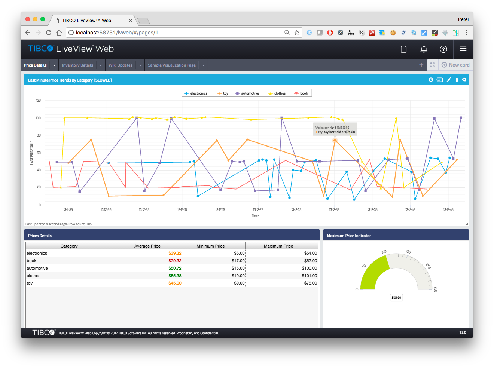

# LiveView fragment examples

* [Directory structure](#directory-structure)
* [Basic build](#basic-build)
* [Launch liveview fragment](#launch-liveview-fragment)

<a name="directory-structure"></a>

## Directory structure
  
The recommended LiveView directory structure is :
  


Note that the default source directory is set by the plugin to 
src/main/liveview.

<a name="basic-build"></a>

## Basic build

The following pom.xml will build, unit test and install to the local maven 
repository, a LiveView fragment.

``` xml
<?xml version="1.0" encoding="UTF-8"?>
<project xmlns="http://maven.apache.org/POM/4.0.0" xmlns:xsi="http://www.w3.org/2001/XMLSchema-instance" xsi:schemaLocation="http://maven.apache.org/POM/4.0.0 http://maven.apache.org/xsd/maven-4.0.0.xsd">

    <!-- vim: set tabstop=4 softtabstop=0 expandtab shiftwidth=4 smarttab : -->

    <modelVersion>4.0.0</modelVersion>

    <groupId>com.tibco.ep</groupId>
    <artifactId>lvfrag</artifactId>
    <packaging>ep-liveview-fragment</packaging>
    <version>1.0.0</version>
    <name>hello world</name>

    <!-- common definitions for this version of StreamBase -->
    <parent>
        <groupId>com.tibco.ep.sb.parent</groupId>
        <artifactId>ep-liveview-fragment</artifactId>
        <version>10.4.0}</version>
    </parent>

</project>
```

When the maven install goal is called (mvn install), this pom.xml instructs
maven to perform the following steps :
  
1. Uses [install-product](https://tibcosoftware.github.io/tibco-streaming-maven-plugin/1.5.0-SNAPSHOT/ep-maven-plugin/install-product-mojo.html) to check if the 
    dependent product ( in this com.tibco.ep.thirdparty:tibco-sb_linuxx86_64 ) is
    installed.  If its not, maven will download the archive and the plugin
    will extract into $TIBCO_EP_HOME.
    
2. Uses the standard maven plugin [maven-compiler-plugin:testCompile](https://maven.apache.org/plugins/maven-compiler-plugin/testCompile-mojo.html)
    to compile any java test sources to class files.
    
3. Uses [start-nodes](https://tibcosoftware.github.io/tibco-streaming-maven-plugin/1.5.0-SNAPSHOT/ep-maven-plugin/start-nodes-mojo.html) to start a test cluster.  
    Since this pom.xml has no configuration, a single node is started 
    A.$\{artifactId\} (ie A.goldylocks in this example) with a random but unused 
    discovery port.
    
4. Uses [test-liveview-fragment](https://tibcosoftware.github.io/tibco-streaming-maven-plugin/1.5.0-SNAPSHOT/ep-maven-plugin/test-liveview-fragment-mojo.html) 
    to launch sbunit on the cluster and report the test results.  Should the 
    test cases fail then no further processing occurs.
    
5. Uses [stop-nodes](https://tibcosoftware.github.io/tibco-streaming-maven-plugin/1.5.0-SNAPSHOT/ep-maven-plugin/stop-nodes-mojo.html) to stop and remove the test 
    nodes
  
6. Uses [package-liveview-fragment](https://tibcosoftware.github.io/tibco-streaming-maven-plugin/1.5.0-SNAPSHOT/ep-maven-plugin/package-liveview-fragment-mojo.html) 
    to create a LiveView fragment zip file in the build directory (by 
    default, set to target) and attaches it to the build.  Note that the fragment
    zip will include any LiveView Web plugins, themes and wars.
    
7. Uses the standard maven plugin [maven-install-plugin:install](https://maven.apache.org/plugins/maven-install-plugin/install-mojo.html)
    to install the built and tested artifacts to the local maven repository.
    

<a name="launch-liveview-fragment"></a>

## Launch liveview fragment

Whilst launching of liveview is usually done when an application archive is
deployed, its possible to start the fragment using [deploy-fragment](https://tibcosoftware.github.io/tibco-streaming-maven-plugin/1.5.0-SNAPSHOT/ep-maven-plugin/deploy-fragment-mojo.html).
For example a test case might want to start liveview and use playback to inject
test data.

One challenge, though, is waiting for liveview to be completely started up -
the [maven-antrun-plugin](http://maven.apache.org/plugins/maven-antrun-plugin/)
can be used to monitor the log file.
  
``` xml
...
    <!-- common definitions for this version of StreamBase -->
    <parent>
        <groupId>com.tibco.ep.sb.parent</groupId>
        <artifactId>ep-liveview-fragment</artifactId>
        <version>10.4.0</version>
    </parent>
...
    <build>

        <plugins>

            <plugin>
                <groupId>com.tibco.ep</groupId>
                <artifactId>ep-maven-plugin</artifactId>
                <extensions>true</extensions>
                <executions>

                    <!-- start nodes -->
                    <execution>
                        <id>start nodes</id>
                        <phase>pre-integration-test</phase>
                        <goals><goal>start-nodes</goal></goals>
                    </execution>
                    
                    <!-- deploy fragment  -->
                    <execution>
                        <id>deploy fragment</id>
                        <phase>integration-test</phase>
                        <goals><goal>deploy-fragment</goal></goals>
                        <configuration>
                            <fragmentType>LIVEVIEW</fragmentType>
                            <target>liveview</target>
                            <arguments>
                                <argument>project=${project.basedir}/src/main/liveview</argument>
                            </arguments>
                        </configuration>
                    </execution>

                    <!-- tests can be added  -->

                    <!-- stop nodes -->
                    <execution>
                        <id>stop nodes</id>
                        <phase>post-integration-test</phase>
                        <goals><goal>stop-nodes</goal></goals>
                    </execution>
                    
                </executions>
            </plugin>
            <plugin>
                <groupId>org.apache.maven.plugins</groupId>
                <artifactId>maven-antrun-plugin</artifactId>
                <executions>
                
                    <!-- wait for liveview to be started  -->
                    <execution>
                        <id>wait for liveview</id>
                        <phase>integration-test</phase>
                        <goals><goal>run</goal></goals>
                        <configuration>
                            <target>
                                <!-- wait for max 5 minutes checking every 500ms -->
                                <waitfor maxwait="5" maxwaitunit="minute" checkevery="500">
                                    <resourcecontains resource="${project.build.directory}/test-nodes/A.${project.artifactId}/liveview0.out" substring="LiveView is ready to accept client connections"/>
                                </waitfor>
                            </target>
                            <skip>${skipTests}</skip>
                        </configuration>
                    </execution>
                    
                </executions>
            </plugin>

        </plugins>

    </build>
```

## Add LiveView Web war file

The LiveView Web war file is a maven dependency and can be added to a project
thus :
  
``` xml
...
    <!-- common definitions for this version of StreamBase -->
    <parent>
        <groupId>com.tibco.ep.sb.parent</groupId>
        <artifactId>ep-liveview-fragment</artifactId>
        <version>10.4.0</version>
        <relativePath/>
    </parent>
...
    <dependencies>
        ...
        <dependency>
            <groupId>com.tibco.ep.lvweb</groupId>
            <artifactId>lvweb</artifactId>
            <type>war</type>
            <scope>provided</scope>
        </dependency>
        ...
    </dependencies>
...
```

The parent pom will copy this dependency to the build directory ready to be added to the fragment archive :

``` shell
...
[INFO] --- maven-dependency-plugin:2.8:copy-dependencies (copy lvweb) @ hellolvweb ---
[INFO] Copying lvweb-1.2.0.war to /Users/plord/workspace/dtmexamples/liveview-fragments/hellolvweb/target/classes/lv-user-webapps/lvweb.war
...
```

The LiveView application startup continues with :
  
``` shell
...
[INFO] [A.hellolvweb] 2017-03-08 13:06:31.457+0000 [JettyService] INFO  c.s.l.server.core.JettyService - LiveView Web service listening on non-SSL port 58731
...
[INFO] [A.hellolvweb] *** All tables have been loaded. LiveView is ready to accept client connections.  Total start time(ms): 137945 ***
...
```



